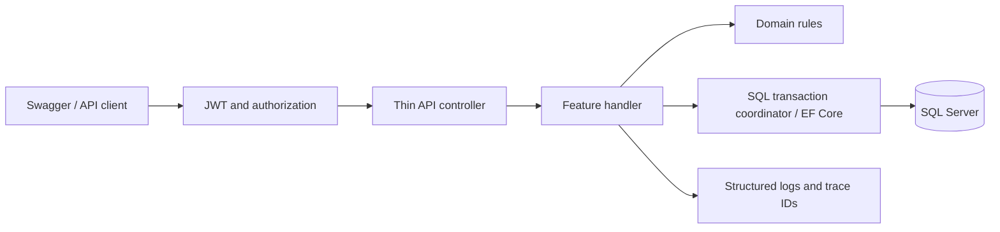
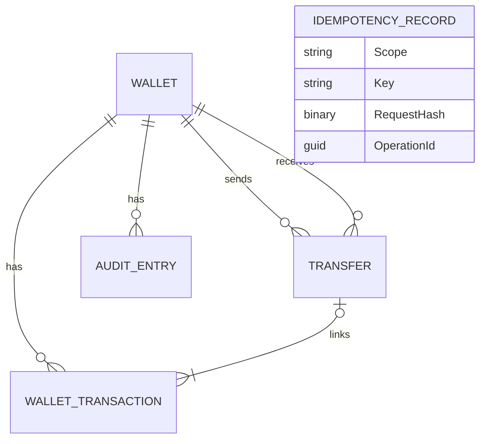
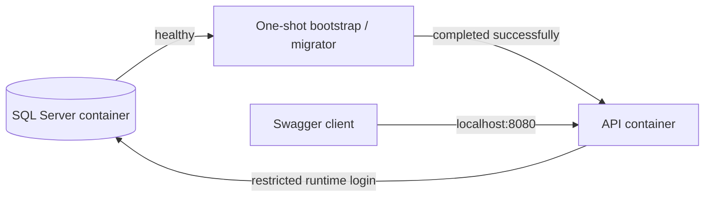

# NovaWallet Ledger Service — Technical Design

**Candidate:** Andrew Osabuede Gabriel  
**Assessment:** FirstBank Nigeria — Backend / API Developer (.NET)  
**Version:** 1.1
**Date:** 16 September 2026  
**Status:** Core implementation complete. 23 unit tests, 15 SQL integration tests, and the deployed Compose smoke test passed. Presentation and repository publication remain separate handoff work.

## Context

NovaPay is a fictional financial super-app. This service implements the simplified wallet ledger behind its NovaWallet module: wallet creation, balance retrieval, simulated inbound funding, internal transfers, statements, daily limits, and audit evidence.

The central requirement is not CRUD. It is protecting a customer's money when requests overlap, clients retry, connections fail, or the application stops unexpectedly.

A successful transfer must debit one wallet and credit another exactly once as a single database transaction. No customer may spend money that is unavailable or exceed the configured daily outbound limit.

This document is the implementation reference. Once the code and tests are complete, it will be updated to reflect the verified design. The README and 10-minute PowerPoint will be derived from that verified version.

### Required Now

- Create one wallet for a customer, starting at zero.
- Return the NGN balance in naira under `balance` and integer kobo under `balanceInKobo`.
  Stored balances remain integer kobo.
- Credit a wallet to simulate an inbound NIP transfer.
- Transfer funds atomically and safely under concurrent requests.
- Require transfer idempotency and reject conflicting key reuse.
- Return paginated wallet history, newest first.
- Enforce a daily outbound transfer limit resetting at midnight WAT.
- Record every balance mutation in a separate, append-only audit trail.
- Protect business endpoints with JWT bearer authentication.
- Return consistent structured errors.
- Start the service and datastore with `docker compose up`.
- Supply Swagger, automated tests, README, and an honest AI usage record.

### Selected Differentiators

- Transfer rate limiting.
- Structured logging with trace identifiers.
- Liveness and database-backed readiness endpoints.

The transactional outbox is excluded from the initial submission. It may be added only after all mandatory requirements and selected stretch features are implemented and verified.

## Business Rules and Assumptions

The following are **assessment design assumptions**, not additional FirstBank product policies:

- A customer ID is a GUID and has one wallet.
- NGN is the only supported currency.
- Transfers are internal wallet-to-wallet movements, not real NIBSS settlement instructions.
- Customers can send to another customer's wallet, but can debit only their own wallet.
- Customers cannot credit themselves through the funding endpoint; funding is a trusted-system operation.
- A wallet cannot transfer to itself.
- The daily limit is `50_000_000` kobo, equivalent to ₦500,000.
- Only completed outbound transfers count towards the limit. Inbound credits do not consume or restore the limit.
- Wallet creation is not a balance mutation: the wallet starts at zero without a monetary history entry.
- BVN, NIN, card data, real bank credentials, and real customer data are not collected.

### Financial Invariants

1. All stored and computed money uses signed 64-bit integer kobo values.
2. A wallet balance is always greater than or equal to zero.
3. Every requested credit or transfer amount is greater than zero.
4. A transfer preserves the combined balance of its two wallets.
5. Debit, credit, transfer record, history entries, audit entries, and successful idempotency result commit together.
6. An idempotent replay does not mutate a balance, create another transfer, or consume more daily allowance.
7. A committed idempotency key remains bound to its original payload and outcome.
8. Every actual balance mutation creates one wallet transaction and one audit entry.
9. All balance-changing handlers use the same database locking protocol.

```csharp
public long BalanceKobo { get; private set; }
public long AmountKobo { get; init; }
```

```plaintext
₦1.00       = 100 kobo
₦1,500.00   = 150,000 kobo
₦500,000.00 = 50,000,000 kobo
```

`float` and `double` are excluded from the money path. Credit and transfer requests
accept numeric `amount` in naira with at most two decimal places. The shared
`MoneyConversion.TryNairaToKobo` method parses exact fixed-point digits using integer
arithmetic, invoked by the `NairaAmount` JSON converter before handlers execute.
No rounding or truncation occurs. Reject strings, scientific notation, non-positive
amounts, excess precision, and values above 92,233,720,368,547,758.07 naira.
Internal amounts, fingerprints, stored balances, history, audit and limits remain
integer kobo. The balance endpoint presents decimal naira under `balance` and integer
kobo under `balanceInKobo`. Credits present `amountKobo` and exact cumulative
`totalbalanceInNaira`. Transfers present `amountKobo` and `sourceBalanceInNaira`.
Statement and audit monetary fields retain their kobo units.
Legacy `amountKobo` requests are rejected.
Arithmetic uses `checked`
operations. Before crediting, verify `amountKobo <= long.MaxValue - balanceKobo`.

## Proposed Architecture

Use a single-application monolith with lightweight vertical slices. These are feature boundaries, not fully isolated business modules: they share domain and persistence infrastructure. Each capability owns its request/response models, validation, and handler. Controllers handle HTTP concerns and invoke handlers through standard dependency injection.

```plaintext
src/
  NovaWallet.Api/
    Controllers/
    Features/
      Wallets/CreateWallet/
      Wallets/GetBalance/
      Wallets/CreditWallet/
      Transfers/TransferFunds/
      Statements/GetStatement/
      Audit/GetAuditTrail/
    Domain/
    Infrastructure/
      Persistence/
      Authentication/
      Time/
    Common/
      Results/
      Errors/
    Program.cs
tests/
  NovaWallet.UnitTests/
  NovaWallet.IntegrationTests/
```

This is one application project, not a framework-heavy collection of projects. Namespace and folder boundaries keep responsibilities distinct.



### Technology Decisions

| Area | Selection | Reason |
| --- | --- | --- |
| Runtime | .NET 9 / ASP.NET Core 9 | Allowed by the brief and installed locally |
| HTTP layer | Controllers with `/api/v1` routes | Familiar enterprise API structure; thin HTTP boundary |
| Application structure | Vertical slices and standard DI | Clear use cases without dispatch-framework ceremony |
| Persistence | EF Core 9 with parameterized SQL for locking | Productive mappings plus explicit consistency controls |
| Database | SQL Server 2022 | Selected enterprise datastore with transactional locking |
| Testing | xUnit and real SQL Server via Testcontainers | Exercises actual provider, constraints, and locks |
| Packaging | Docker Compose | Reproducible service and datastore startup |

Nullable reference types are enabled. Requests and responses use immutable DTOs where practical. EF entities are not exposed through HTTP responses. Domain methods own debit/credit arithmetic; handlers own orchestration; infrastructure owns SQL access.

Use interfaces only for replaceable boundaries such as the clock and current caller. A scoped `DbContext` is never shared by concurrent requests. Retry attempts create fresh contexts. Read-only queries use projections and `AsNoTracking()` where appropriate.

### Runtime Support — Important

.NET 9 meets this assessment's explicit .NET 8/9 restriction. It is not being selected as a long-lived production baseline: as of this document's date, its support ends on 10 November 2026. A production release would need an upgrade plan to a supported baseline. [.NET support policy](https://dotnet.microsoft.com/en-us/platform/support/policy).

## Data Model

All business GUIDs are application-generated. Timestamps use `datetimeoffset(7)` with offset zero and are rendered as UTC ISO-8601 strings. Monetary columns use SQL Server `bigint`.

Foreign keys use restricted deletion rather than cascading deletion. Wallets, transfers, financial history, and audit evidence are not deleted through this API.

### Wallet Table

```plaintext
Wallet
Property - Id                 : uniqueidentifier, primary key
Property - CustomerId         : uniqueidentifier, required, unique
Property - Currency           : char(3), required, NGN
Property - BalanceKobo        : bigint, required, starts at 0
Property - CreatedAtUtc       : datetimeoffset(7), required
Property - UpdatedAtUtc       : datetimeoffset(7), required
```

Constraints:

```sql
CHECK (BalanceKobo >= 0)
CHECK (Currency = 'NGN')
UNIQUE (CustomerId)
```

The wallet balance is the operational balance used for spending decisions. Immutable history supports reconciliation. This is not full event sourcing or a complete general-ledger accounting system.

### Transfer Table

```plaintext
Transfer
Property - Id                  : uniqueidentifier, primary key / operation ID
Property - SourceWalletId      : uniqueidentifier, FK to Wallet
Property - DestinationWalletId : uniqueidentifier, FK to Wallet
Property - AmountKobo          : bigint, required
Property - Status              : int, required, Completed
Property - CompletedAtUtc      : datetimeoffset(7), required
Property - InitiatedBySubjectId : uniqueidentifier, required
```

Only committed transfers exist in this table. Rejected requests are represented by their idempotency outcome, not a partially completed transfer.

```csharp
public enum TransferStatus
{
    Completed = 1
}
```

Constraints and index:

```sql
CHECK (AmountKobo > 0)
CHECK (SourceWalletId <> DestinationWalletId)
CHECK (Status = 1)
-- Daily usage query:
-- INDEX (SourceWalletId, CompletedAtUtc) INCLUDE (AmountKobo, Status)
```

No reversal, pending-settlement, or refund workflow is included. Future reversals must create compensating records rather than editing historical transfers.

### WalletTransaction Table

```plaintext
WalletTransaction
Property - Id                : bigint identity, primary key
Property - WalletId          : uniqueidentifier, FK to Wallet
Property - OperationId       : uniqueidentifier, required
Property - TransferId        : uniqueidentifier, nullable FK to Transfer
Property - Type              : int, required
Property - AmountKobo        : bigint, positive magnitude
Property - BalanceBeforeKobo : bigint, required
Property - BalanceAfterKobo  : bigint, required
Property - CreatedAtUtc      : datetimeoffset(7), required
```

```csharp
public enum WalletTransactionType
{
    InboundCredit = 1,
    TransferDebit = 2,
    TransferCredit = 3
}
```

`OperationId` is the credit operation ID or transfer ID. Transfers have two entries; an inbound credit has one. Direction comes from `Type`, not a negative amount.

Constraints:

- Positive amount and non-negative before/after balances.
- Inbound credits have a null `TransferId`; transfer entries have a non-null `TransferId` equal to `OperationId`.
- Debit arithmetic: `BalanceBeforeKobo >= AmountKobo` and `BalanceAfterKobo = BalanceBeforeKobo - AmountKobo`.
- Credit arithmetic: `BalanceAfterKobo >= AmountKobo` and `BalanceBeforeKobo = BalanceAfterKobo - AmountKobo`.
- Unique `(WalletId, OperationId)` prevents duplicate history for one wallet mutation.
- Statement index: `(WalletId, CreatedAtUtc DESC, Id DESC)`.

Subtraction-based constraints avoid overflowing SQL `bigint` when checking a credit equation. History entries are append-only under runtime permissions.

### AuditEntry Table

```plaintext
AuditEntry
Property - Id                : bigint identity, primary key
Property - WalletId          : uniqueidentifier, FK to Wallet
Property - OperationId       : uniqueidentifier, required
Property - Operation         : int, required
Property - AmountKobo        : bigint, positive magnitude
Property - BalanceBeforeKobo : bigint, required
Property - BalanceAfterKobo  : bigint, required
Property - ActorSubjectId    : uniqueidentifier, required
Property - OccurredAtUtc     : datetimeoffset(7), required
Property - TraceId           : varchar(32), required
```

```csharp
public enum AuditOperation
{
    InboundCredit = 1,
    TransferDebit = 2,
    TransferCredit = 3
}
```

Audit entries use the same positive-amount and before/after arithmetic constraints as history, plus unique `(WalletId, OperationId)` and index `(WalletId, OccurredAtUtc DESC, Id DESC)`.

The actor comes from the validated JWT, not a request body. For a transfer, both audit entries identify the initiating customer. For a credit, the actor identifies the funding-system caller.

### IdempotencyRecord Table

```plaintext
IdempotencyRecord
Property - Id                 : uniqueidentifier, primary key
Property - Scope              : varchar(80), required, binary collation
Property - Key                : varchar(128), required, binary collation
Property - RequestHash        : binary(32), required
Property - Status             : int, required
Property - OperationId        : uniqueidentifier, nullable
Property - HttpStatusCode     : int, required on terminal outcome
Property - ResponseJson       : nvarchar(max), required on terminal outcome
Property - ResponseContentType: varchar(64), required on terminal outcome
Property - ResponseLocation   : varchar(256), nullable
Property - CreatedAtUtc       : datetimeoffset(7), required
Property - CompletedAtUtc     : datetimeoffset(7), required on terminal outcome
```

```csharp
public enum IdempotencyStatus
{
    Processing = 1,
    Completed = 2,
    Rejected = 3
}
```

`Processing` exists only inside an uncommitted transaction. A committed row must be terminal. `Completed` has an operation ID and a successful response; `Rejected` has a business-error response and no operation ID.

Use unique `(Scope, Key)` with `Latin1_General_100_BIN2` collation so SQL equality agrees with case-sensitive key matching. Add a status/outcome consistency check. There is no expiry or cleanup in the assessment: forgetting a key would permit an old request to be processed again.

### Relationships



`OperationId` connects idempotency, financial history, and audit evidence. It is not an FK to a shared operation table: inbound credits and transfers have different record shapes. Atomic insertion and reconciliation tests verify this relationship.

## Wallet Creation

**Authentication:** Customer JWT.  
**Ownership:** The requested customer ID must equal the JWT `customer_id`.

```http
POST /api/v1/wallets
Authorization: Bearer <token>
Content-Type: application/json
```

**Request payload:**

```json
{
  "customerId": "7dbecbac-45b8-48a6-a81e-43209e7aa119"
}
```

**Response — `201 Created`:**

```json
{
  "walletId": "11111111-1111-1111-1111-111111111111",
  "customerId": "7dbecbac-45b8-48a6-a81e-43209e7aa119",
  "currency": "NGN",
  "balanceKobo": 0,
  "createdAtUtc": "2026-09-16T09:00:00Z"
}
```

Set `Location` to the wallet balance route. Validate non-empty GUIDs. A duplicate customer wallet returns `409 wallet-already-exists`; the unique constraint is authoritative even when two creation requests overlap. No idempotency header is required for wallet creation.

The duplicate response also includes the existing wallet ID and its balance route in the Location header, after ownership verification. This lets the customer recover a generated ID when the original creation response was lost.

## Balance Retrieval

**Authentication:** Customer JWT.  
**Ownership:** Wallet belongs to the authenticated customer.

```http
GET /api/v1/wallets/{walletId}/balance
```

**Response — `200 OK`:**

```json
{
  "walletId": "11111111-1111-1111-1111-111111111111",
  "currency": "NGN",
  "balance": 1500,
  "balanceInKobo": 150000
}
```

Project only required columns. Convert the stored `long` kobo balance with
`MoneyConversion.KoboToNaira` for an exact decimal response, including zero and
`long.MaxValue`. Return the stored balance directly under `balanceInKobo` as well.
No float/double or rounding is used. The explicit kobo field satisfies the brief's unit
requirement; clients must still adopt the updated field names. Return `404` for a missing
wallet and `403` for an existing
wallet owned by another customer. Production may choose a uniform `404` policy to reduce
resource enumeration.

## Wallet Credit

Credits simulate a trusted inbound NIP notification. They are not a customer-operated deposit button.

**Permission required:** `FundingSystem` or `Admin` role.

```http
POST /api/v1/wallets/{walletId}/credits
```

**Request payload:**

```json
{
  "amount": 100000,
  "reference": "NIP-DEMO-20260916-0001"
}
```

The reference is required and follows the same key character/length rules as transfer idempotency. Its scope is fixed to `credit:nip-simulator`, independent of the funding actor. This prevents two funding identities from crediting the same simulated notification twice.

**Response — `200 OK`:**

```json
{
  "creditId": "33333333-3333-3333-3333-333333333333",
  "walletId": "11111111-1111-1111-1111-111111111111",
  "amountKobo": 10000000,
  "currency": "NGN",
  "totalbalanceInNaira": 100000,
  "completedAtUtc": "2026-09-16T09:05:00Z"
}
```

Processing:

1. Authenticate and enforce the funding role.
2. Validate and convert the naira amount to integer kobo; validate wallet ID and reference.
3. Begin a transaction and acquire the reference's idempotency lock.
4. Replay or reject an existing reference using the canonical payload hash.
5. Lock the wallet using the shared wallet-lock protocol.
6. Check existence and overflow before applying the credit.
7. Add one history entry and one audit entry.
8. Store the successful idempotency response and commit all effects together.

Matching replay returns the original response, not the wallet's later balance. Reusing a reference with another wallet or amount returns `409`. Credits do not consume the daily outbound allowance.

`totalbalanceInNaira` is the cumulative post-credit balance, not merely this credit's
amount. `amountKobo` remains the deposit amount in kobo. The old `balanceAfterKobo`
response property is removed from newly committed outcomes. Existing references replay
their exact original stored response, including the old shape where applicable; do not
rewrite historical idempotency responses. Financial history and audit remain in kobo.

## Transfer Funds

**Authentication:** Customer JWT.  
**Ownership:** Only the source wallet must belong to the caller. The destination may belong to another customer.

```http
POST /api/v1/transfers
Authorization: Bearer <token>
Idempotency-Key: transfer-demo-0001
Content-Type: application/json
```

**Request payload:**

```json
{
  "sourceWalletId": "11111111-1111-1111-1111-111111111111",
  "destinationWalletId": "22222222-2222-2222-2222-222222222222",
  "amount": 10000
}
```

**Response — `200 OK`:**

```json
{
  "transferId": "44444444-4444-4444-4444-444444444444",
  "sourceWalletId": "11111111-1111-1111-1111-111111111111",
  "destinationWalletId": "22222222-2222-2222-2222-222222222222",
  "amountKobo": 1000000,
  "currency": "NGN",
  "status": "Completed",
  "sourceBalanceInNaira": 90000,
  "completedAtUtc": "2026-09-16T09:10:00Z"
}
```

Do not reveal the recipient's balance or customer identity in the transfer response. Enum values are serialized as strings.

### Concurrency Problem — Important

```plaintext
Starting balance: ₦10,000
Request A: transfer ₦8,000
Request B: transfer ₦7,000

Unsafe implementation:
A reads ₦10,000 → sufficient
B reads ₦10,000 → sufficient
A debits and credits the recipient
B debits and credits the recipient

Both succeed even though ₦15,000 was unavailable.
```

A C# balance check, an ordinary `SaveChangesAsync()`, or an in-memory lock does not establish cross-instance financial correctness. SQL Server must serialize competing mutations.

### SQL Server Transaction and Locking Strategy

Use an explicit `READ COMMITTED` transaction with targeted wallet locks. This refines the earlier broad serializable-transaction proposal: wallet reads use serializable-style hints, while unrelated queries are not unnecessarily run at serializable isolation.

For each wallet, issue a **separate parameterized lookup** inside the active EF database transaction:

```sql
SELECT Id, CustomerId, Currency, BalanceKobo, CreatedAtUtc, UpdatedAtUtc
FROM dbo.Wallets WITH (UPDLOCK, HOLDLOCK)
WHERE Id = @WalletId;
```

Set `LOCK_TIMEOUT` to 10,000 milliseconds on the financial connection before these lookups and use a 30-second database command timeout. Map SQL lock-timeout error 1222 to `503 operation-busy` after rollback. These are bounded contention waits, not proof that an operation already committing has failed.

Convert wallet IDs to lowercase `D`-format strings, sort using `StringComparer.Ordinal`, and execute the two lookups sequentially in that order. Every handler uses this comparison. Do not assume that a single `IN (...) ORDER BY ...` query guarantees physical lock acquisition order.

`UPDLOCK` keeps update locks through transaction completion, while `HOLDLOCK` supplies serializable semantics for the referenced table. SQL Server may use key, page, or table locks; correctness must not depend on guaranteed row-only granularity. Deterministic lookups reduce deadlocks, but do not prove deadlocks impossible. [SQL Server table hints](https://learn.microsoft.com/en-us/sql/t-sql/queries/hints-transact-sql-table?view=sql-server-ver17).

The coordinator reads locked wallet state through the same connection/context/transaction that writes the changes. No previously tracked or stale wallet instance is used for balance decisions. No network calls occur inside the financial transaction.

### Transfer Processing Sequence

1. Authenticate and validate request syntax, non-empty IDs, positive amount, distinct wallets, and idempotency header.
2. Perform an initial source-ownership check. Repeat it against locked state for a new operation.
3. Begin the transaction and acquire the customer-scoped idempotency lock described below.
4. If the key already exists, compare hashes and return the stored outcome or a conflict without touching balances.
5. Insert an uncommitted `Processing` idempotency record.
6. Lock both wallets through sequential lookups in the shared deterministic order.
7. Validate existence, source ownership, NGN currency, available funds, and destination overflow.
8. Capture the operation timestamp **after locks are acquired**, calculate its WAT day, and check daily outbound usage.
9. If a financial rule fails (`422`), store a terminal rejected outcome with no financial changes and commit that outcome. If locked existence/ownership checks fail, roll back the uncommitted key and return `404`/`403`.
10. Otherwise debit the source and credit the destination using checked domain methods.
11. Insert one completed transfer, two history entries, and two audit entries sharing the operation ID and timestamp.
12. Set the idempotency record to `Completed` and store the exact response JSON/status/content type.
13. Save and commit. Return success only after commit.

```mermaid
sequenceDiagram
    participant C as Client
    participant A as Controller / handler
    participant D as SQL Server
    C->>A: Transfer + JWT + Idempotency-Key
    A->>A: Validate syntax and source ownership
    A->>D: Begin transaction; lock scoped key
    A->>D: Read idempotency outcome
    alt Existing matching request
        D-->>A: Stored outcome
        A->>D: End transaction
        A-->>C: Replay original response
    else New request
        A->>D: Lock wallets in deterministic order
        A->>D: Read balance and WAT daily usage
        alt Business rejection
            A->>D: Store rejected outcome; commit
            A-->>C: Problem Details
        else Valid transfer
            A->>D: Write balances, transfer, history, audit, response
            A->>D: Commit
            A-->>C: Completed transfer
        end
    end
```

### Failure, Cancellation, and Retry Behavior

Unexpected failures before commit roll back balances, history, audit, and the uncommitted key together. SQL exceptions are technical failures, not a substitute for ordinary validation results.

Use bounded retries around the **entire transaction**, with fresh contexts, at most three total attempts and jittered backoff. Retry SQL deadlock victims and provider-classified transient connection failures only. Do not independently retry a debit, credit, or `SaveChangesAsync()` within the operation. Do not combine a custom loop with another unbounded/nested retry policy.

If the connection fails during commit, the outcome is unknown—not automatically rolled back. Recovery enters the same idempotency protocol on a fresh connection: a committed terminal record proves the operation completed; after reacquiring the key lock, an absent record permits a fresh attempt. If verification cannot reach SQL Server, return `503` and tell the client to retry with the **same** key. [EF Core connection resiliency](https://learn.microsoft.com/en-us/ef/core/miscellaneous/connection-resiliency).

Pass cancellation tokens through database operations. Cancellation before a confirmed commit rolls back when possible. Cancellation or a lost response during commit must not be reported as proof that money was not moved. Client retry uses the same key/reference. Dispose failed contexts and transactions; never continue on a failed transaction.

Wallet creation relies on its customer uniqueness constraint rather than financial-operation retries. Following an ambiguous creation response, the client can safely retry creation; a duplicate response means it should retrieve the existing wallet rather than create another.

## Idempotency

The database must protect the interval between checking a key and inserting its result. A unique constraint alone detects duplicates but does not define clean replay behavior for simultaneous requests.

### Key Rules and Scope

- Transfer header: one `Idempotency-Key` value, 1–128 characters.
- Allowed characters: ASCII letters, digits, `.`, `_`, `:`, and `-`.
- Keys are case-sensitive. Whitespace is rejected, not silently trimmed.
- Transfer scope: `transfer:{customerId-in-lowercase-D-format}`.
- Credit scope: `credit:nip-simulator`; the request reference serves as its key.
- Different customers may use the same transfer key without colliding.
- A customer cannot change a source wallet or amount under an existing key.

### Canonical Request Fingerprint

Hash an explicitly constructed UTF-8 string using SHA-256, not raw JSON. This makes JSON property ordering and whitespace irrelevant.

```plaintext
transfer|v1|{sourceWalletId:D lowercase}|{destinationWalletId:D lowercase}|{amountKobo invariant integer}
credit|v1|{walletId:D lowercase}|{amountKobo invariant integer}
```

The key is stored separately. The scope already binds a transfer to its authenticated customer. Missing fields and malformed numeric values are rejected before hashing.

### Serializing Requests Sharing a Key

Within the SQL transaction, acquire a SQL Server-managed resource lock:

```sql
DECLARE @Result int;
EXEC @Result = sys.sp_getapplock
    @Resource = @ResourceName,
    @LockMode = 'Exclusive',
    @LockOwner = 'Transaction',
    @LockTimeout = 10000,
    @DbPrincipal = 'public';
SELECT @Result;
```

`@ResourceName` is `novawallet:idem:` followed by the lowercase hexadecimal SHA-256 hash of `scope + "|" + key`. The protocol uses the same database and principal for every instance.

This is a **database-managed lock**, not a process-local C# lock. Transaction-owned locks are released on commit/rollback. Return values `0` and `1` indicate success; negative results must be handled explicitly. Timeout yields `503 operation-busy`; cancellation stops processing; deadlock victim enters the bounded retry policy; parameter/configuration errors fail without financial work. [SQL Server sp_getapplock](https://learn.microsoft.com/en-us/sql/relational-databases/system-stored-procedures/sp-getapplock-transact-sql?view=sql-server-ver17).

All balance handlers acquire their idempotency lock **before** any wallet lock. The unique index remains a second database defense; the resource lock makes simultaneous replay deterministic even when a key row does not exist yet.

### Replay and Failure Policy

```plaintext
New key
    → Validate locked state, process, and store terminal outcome

Existing key + matching request hash
    → Return original HTTP status and stored body

Existing key + different request hash
    → 409 idempotency-conflict; original record unchanged
```

- Successful outcomes and expected financial rejections (`422`) are stored.
- A stored insufficient-funds rejection remains rejected after a later credit. A deliberate new attempt must use a new key.
- Syntax, authentication, ownership, not-found, and rate-limit failures do not reserve a key. They occur before a terminal financial decision and make no balance changes.
- Unexpected exceptions, lock timeouts, and unavailable-database failures do not create terminal rejected records.
- A changed payload conflicts with a previously committed key regardless of whether the original outcome succeeded or was financially rejected.
- Matching replays add `Idempotency-Replayed: true` and do not create another audit entry.
- Stored error JSON includes the original trace ID. The replay request has its own `X-Trace-Id` response header/log entry, so the historical error body remains unchanged without losing current-request traceability.

The endpoint is still subject to authentication, authorization, and rate limiting on replay. Stored responses are available only inside the authenticated scope.

## Daily Outbound Limit

The daily limit resets at midnight West Africa Time, not the machine's local midnight or UTC midnight.

```plaintext
Limit: ₦500,000 = 50,000,000 kobo
WAT day: 00:00:00 inclusive → next midnight exclusive
WAT offset for this assessment: UTC+01:00

17 September 2026 WAT:
UTC start = 16 September 2026, 23:00:00Z
UTC end   = 17 September 2026, 23:00:00Z
```

Use an injectable clock based on `TimeProvider`. For the stated WAT rule, derive the date with a fixed `+01:00` offset; this is equivalent to present-day Lagos WAT and avoids OS-specific time-zone ID differences. Do not read server-local time.

Read completed transfers where:

```sql
WHERE SourceWalletId = @SourceWalletId
  AND Status = 1
  AND CompletedAtUtc >= @DayStartUtc
  AND CompletedAtUtc < @DayEndUtc
```

Compute `SUM` over `decimal(38,0)` in SQL to avoid aggregate `bigint` overflow, then validate and convert to `long` before application money logic. This aggregate is still exact integer kobo, not fractional money. Treat an impossible total as an integrity error. A null total becomes zero.

Use subtraction-based checking: reject if `amountKobo > dailyLimitKobo - usedKobo`, after checking `usedKobo <= dailyLimitKobo`.

### Concurrent Limit Example

```plaintext
Already sent today: ₦450,000
Two requests each attempt ₦40,000

First request locks source → total becomes ₦490,000 → succeeds.
Second waits for the same source lock.
Second reads ₦490,000 → ₦530,000 would exceed limit → rejected.
```

Every outbound writer holds the source wallet lock until commit, so no other compliant writer can insert another outbound transfer for that source while its usage is being checked. This is why the aggregate and insert are safe without relying on an unlocked read-and-check.

Use one timestamp for the transfer, its entries, and the daily calculation, captured after wallet locks. A request waiting across midnight uses the day when it reaches the locked decision point. A transaction starting its decision just before midnight remains attributed to that timestamp even if commit completes shortly afterward.

The daily limit is a service configuration value, validated as positive at startup. All deployed instances must share the same value. Dynamic KYC-tier limits are out of scope.

## Wallet Statement

**Authentication:** Customer JWT.  
**Ownership:** Wallet belongs to the caller.

```http
GET /api/v1/wallets/{walletId}/statement?page=1&pageSize=20
```

Defaults: `page=1`, `pageSize=20`. Allow `page >= 1` and `1 <= pageSize <= 100`. Validate the calculated offset before passing it to the provider. Invalid ranges return `400`; a page beyond available history returns an empty collection.

**Response — `200 OK`:**

```json
{
  "walletId": "11111111-1111-1111-1111-111111111111",
  "currency": "NGN",
  "page": 1,
  "pageSize": 20,
  "totalCount": 1,
  "items": [
    {
      "transactionId": 2,
      "operationId": "44444444-4444-4444-4444-444444444444",
      "type": "TransferDebit",
      "amountKobo": 1000000,
      "balanceBeforeKobo": 10000000,
      "balanceAfterKobo": 9000000,
      "createdAtUtc": "2026-09-16T09:10:00Z"
    }
  ]
}
```

Order by `CreatedAtUtc DESC, Id DESC`. The ID provides deterministic ordering when timestamps match. Project only response fields.

Run count and page queries in a short read-only snapshot transaction. Provision `ALLOW_SNAPSHOT_ISOLATION ON` during bootstrap, and use `IsolationLevel.Snapshot` only for these paginated reads. This gives one response a consistent count and item set.

Offset pagination is acceptable for the assessment. It does not guarantee stable membership across separate page requests while new entries arrive. A production statement export would use an as-of boundary or cursor rather than silently claiming snapshot consistency across multiple HTTP calls.

## Audit Trail

```plaintext
WalletTransaction
    = customer-facing financial history

AuditEntry
    = evidence of the actor, operation, and exact balance mutation

Application logs
    = operational diagnostics, not financial audit evidence
```

**Permission required:** `Auditor` or `Admin` role.

```http
GET /api/v1/audit/wallets/{walletId}?page=1&pageSize=20
```

Use statement pagination rules and a snapshot read. Return `walletId`, page metadata, and audit items containing ID, operation ID/type, amount, before/after balances, actor subject, occurrence time, and trace ID. A missing wallet returns `404`.

### Transfer Audit Example

```plaintext
Operation ID: 44444444-4444-4444-4444-444444444444
Amount: 1,000,000 kobo (₦10,000)

Source:      10,000,000 → 9,000,000 kobo; TransferDebit
Destination: 5,000,000 → 6,000,000 kobo; TransferCredit

Both entries commit with the transfer and identify the initiating actor.
```

### Database-Level Immutability

- API runtime login receives `SELECT` and `INSERT` on `AuditEntries`, `WalletTransactions`, and `Transfers`, not `UPDATE` or `DELETE`.
- Explicitly deny update/delete on audit and financial-history tables.
- Add SQL triggers rejecting updates and deletes on audit/history/transfer tables as defense in depth, including accidental privileged DML.
- Runtime login has no DDL, `db_owner`, or permission to truncate/drop/disable protection.
- A DbContext save guard rejects modified/deleted history entities before sending SQL.
- EF mappings disable the SQL OUTPUT optimization on trigger-bearing tables using UseSqlOutputClause(false).
- No mutation endpoint or repository method exists for audit history.

This establishes append-only behavior for the application and its runtime identity. A SQL Server administrator can still alter permissions or disable protections; do not describe this as tamper-proof against database administrators. Production would need separation of duties, independent retention/export, and stronger tamper evidence.

## Authentication and Authorization

Use standard ASP.NET Core JWT bearer middleware. Validate signature, issuer, audience, expiry, and required identity claims. Use an explicit role claim mapping rather than relying on defaults.

Example customer claims:

```json
{
  "sub": "7dbecbac-45b8-48a6-a81e-43209e7aa119",
  "customer_id": "7dbecbac-45b8-48a6-a81e-43209e7aa119",
  "role": "Customer",
  "iss": "novawallet-demo",
  "aud": "novawallet-api"
}
```

Actual tokens also contain expiry and issued-at claims. `sub` must be a non-empty GUID for all demo actors. Customer policies require a valid GUID `customer_id`; funding/audit actors need not have a customer identity.

| Operation | Policy | Ownership |
| --- | --- | --- |
| Create wallet | Customer | Body customer ID equals claim |
| Get balance | Customer | Requested wallet belongs to claim |
| Transfer | Customer | Source wallet belongs to claim |
| Get statement | Customer | Requested wallet belongs to claim |
| Credit | FundingSystem or Admin | Trusted funding of any wallet |
| Get audit trail | Auditor or Admin | Authorized inspection of any wallet |

An admin role does not automatically bypass customer-source ownership. An actor needs the relevant policy claims for each operation.

Use a demo signing key of at least 256 bits from configuration. Mint short-lived tokens through a local CLI mode, not an anonymous HTTP endpoint that can issue admin credentials. The CLI supports fixed demonstration customer IDs and funding/auditor roles. Swagger supports pasting bearer tokens.

Business controllers use authorization by default. `/health/live` and `/health/ready` are intentionally anonymous, return minimal information, and expose no secrets. Swagger is available in the assessment environment; production access would be restricted.

## Structured Error Responses

Use Problem Details with `application/problem+json`, including validation errors, JWT failures, permission failures, rate-limit rejection, and unhandled exceptions. Challenge/forbid and rate-limit responses must not fall back to unrelated plain-text bodies.

**Example — insufficient funds:**

```json
{
  "type": "urn:novawallet:problem:insufficient-funds",
  "title": "Insufficient funds",
  "status": 422,
  "detail": "The source wallet has insufficient funds for this transfer.",
  "instance": "/api/v1/transfers",
  "code": "insufficient-funds",
  "traceId": "4bf92f3577b34da6a3ce929d0e0e4736"
}
```

| Status | Code | Meaning |
| --- | --- | --- |
| 400 | invalid-request | Invalid body, GUID, amount, key, or pagination |
| 401 | unauthenticated | Missing, expired, or invalid bearer token |
| 403 | forbidden | Missing permission or another customer's source/resource |
| 404 | wallet-not-found | Required wallet does not exist |
| 409 | wallet-already-exists | Customer already has a wallet |
| 409 | idempotency-conflict | Same scoped key/reference, different payload |
| 422 | insufficient-funds | Requested debit exceeds balance |
| 422 | daily-limit-exceeded | Outbound request exceeds WAT daily allowance |
| 422 | balance-capacity-exceeded | A credit would exceed signed 64-bit capacity |
| 429 | rate-limit-exceeded | Transfer request allowance exceeded |
| 503 | operation-busy | Scoped key or wallet lock wait expired |
| 503 | datastore-unavailable | Database unavailable or transient retries exhausted |
| 500 | internal-error | Unexpected fault or detected integrity violation |

Validation responses also contain an `errors` dictionary. Expected failures use result objects mapped by controllers; exceptions represent unexpected technical faults. Never expose SQL text, stack traces, tokens, connection strings, or recipient financial information.

## Logging, Rate Limiting, and Health

### Structured Logging

Emit JSON logs with named properties: `TraceId`, `OperationId`, endpoint, outcome code, status, duration, and retry count. Use server-generated trace context and return `X-Trace-Id`. On matching idempotent replay, log replay rather than another financial mutation.

Do not log bearer tokens, signing keys, passwords, raw idempotency keys, request bodies, BVNs, NINs, or card details. Audit actors are stored in the restricted database trail; operational logs do not need to duplicate customer identity fields.

### Transfer Rate Limiting

Apply a fixed-window policy after authentication, partitioned by validated customer ID:

```plaintext
Permit limit: 200 transfer requests per minute
Queue limit: 0
Rejection: 429 Problem Details + Retry-After
```

This is an assessment abuse-control setting, not a bank-approved product quota. Configure it without changing handlers. The default accommodates the required 100-request concurrency test. Financial tests can override the policy to isolate database correctness; a separate test verifies actual throttling.

The limiter is per API instance. It does not establish financial correctness or a cluster-wide quota. A production cluster would use a gateway/shared limiter.

### Health Endpoints

```http
GET /health/live
GET /health/ready
```

- Liveness: process can respond; no database dependency.
- Readiness: required schema exists and a short SQL probe succeeds through the runtime identity.
- Healthy returns `200`; unready returns `503`.
- Readiness does not expose connection diagnostics publicly.

## Docker and Database Startup

From a clean checkout with Docker running:

```bash
docker compose up
```

Compose includes a build definition, so initial startup builds the API/migrator image. Following code changes, use:

```bash
docker compose up --build
```



### Startup Sequence

1. SQL Server 2022 starts using a named data volume and an actual database health check.
2. A one-shot migrator, using the privileged bootstrap credential, creates the database if absent.
3. It enables snapshot reads, applies checked-in EF migrations, creates the runtime SQL login/user, and grants the narrow table permissions.
4. It installs immutability triggers and exits successfully.
5. Compose starts the API only after migration success.
6. The API uses only the runtime connection string and fails configuration validation if required settings are invalid.

The API must not run privileged migrations on every normal startup. Bootstrap is repeatable, migration failure is fatal, and existing data is preserved. Only the single migrator coordinates schema changes in this Compose workflow.

### Configuration

- Expose API on `127.0.0.1:8080`; Swagger at `/swagger`.
- Do not publish the SQL port to the host by default.
- Use named SQL storage; no automatic reset or volume deletion.
- Provide disposable development defaults for Compose so the panel's single command needs no manual secret generation.
- Label those defaults prominently as demo-only; allow environment overrides and include `.env.example`.
- Never include real secrets or production credentials. Ignore local `.env` files.
- Trust the development SQL container certificate only in demo/test settings. Require validated certificates and TLS termination in production.
- Pin .NET 9 SDK/runtime major lines and SQL Server 2022; record actual package/image versions when implementation is verified.

Docker Desktop must run Linux containers on the current x64 laptop. It was started during implementation; Docker image build, Compose startup, migrations, and deployed smoke checks have now passed.

### Planned Verification Commands

```bash
docker compose config
dotnet restore
dotnet build
dotnet test tests/NovaWallet.UnitTests
dotnet test tests/NovaWallet.IntegrationTests
docker compose up --build
```

Integration tests require Docker and provision isolated SQL Server databases/containers rather than modifying the demonstration datastore. Package restores and image pulls require network access.

## Testing Strategy

Tests must prove behavior against SQL Server, not merely demonstrate happy-path controller calls. EF's in-memory provider cannot validate the chosen SQL locks, transaction boundaries, permissions, or constraints.

### Unit Tests

- Exact naira-to-kobo conversion; reject non-positive/out-of-range JSON and more than two decimal places.
- Checked debit/credit and destination overflow.
- Canonical hashes unaffected by JSON property ordering.
- Key character, length, and case rules.
- WAT day boundaries using a controllable clock.
- Subtraction-based daily-limit checks.
- Request validation and business-result mapping.

### Concurrent Overspending — Required

```plaintext
Initial source balance:      10,000,000 kobo (₦100,000)
Initial destination balance: 0
Requests:                   100 concurrent transfers
Amount per request:         1,000,000 kobo (₦10,000)
Keys:                       100 distinct keys

Expected:
10 responses = 200
90 responses = 422 insufficient-funds
Source balance = 0
Destination balance = 10,000,000
10 transfer records
20 transfer history entries
20 transfer audit entries
100 terminal idempotency outcomes
Combined balance unchanged
```

Exclude the initial funding entry when counting transfer history/audit. Use a start barrier, separate request scopes/contexts, and real HTTP requests. Repeat under load with bounded test timeouts. Intermittent technical `503` failures must not be accepted as sufficient evidence for the exact expected outcome.

### Concurrent Identical Requests

```plaintext
Requests: 50 concurrent calls
Key: same customer-scoped key
Payload: identical

Expected:
One debit and one credit
One transfer and one completed idempotency row
Two history entries and two audit entries
All responses resolve to the same stored transfer/body
49 requests identified as replays
```

Also send matching requests through two independently hosted API instances connected to the same SQL database. This verifies that correctness is not process-local.

### Conflicting Key Reuse

- Sequential changed destination/amount: `409`, no additional mutation.
- Simultaneous different payloads under one key: one payload becomes bound; the other returns `409`.
- Same key for different customers: independent scopes, no cross-customer replay.
- Stored `422` replay after a credit: original rejection returned; a new key permits a new decision.
- Credit reference replay through another funding identity: no duplicate credit.

### Concurrent Daily Limit

```plaintext
Already sent today: ₦450,000
Available source funds: at least ₦80,000
Requests: two concurrent ₦40,000 transfers, distinct keys

Expected:
One succeeds
One returns 422 daily-limit-exceeded
Daily outbound usage ends at ₦490,000
Source debit totals ₦40,000
```

Test immediately before/at WAT midnight and requests that wait for locks across midnight. Replayed success must not increment usage.

### Opposing Transfers and Lock Contention

- Run A→B and B→A concurrently using the shared wallet order.
- Verify balance conservation, terminal responses, and no partial history.
- Exercise bounded retry behavior when SQL chooses a deadlock victim.
- Hold a key/wallet lock in a controlled connection and verify timeout maps to `503`, not a debit or a permanent business rejection.

### Rollback and Unknown Commit

- Inject failures after in-memory debit, after persistence but before commit, and on audit insertion.
- Assert no financial or idempotency effects commit on confirmed rollback.
- Simulate a lost HTTP response after successful commit; same-key retry returns the stored result.
- Exercise commit-outcome verification with controlled fault injection; never treat a commit exception alone as proof of rollback.
- Verify repeated credits after a lost response are also safe through the reference protocol.

### Audit, Security, and Query Tests

- Every balance-changing operation has matching history and audit arithmetic.
- Replays and rejected financial requests have no extra balance-mutation audit entries.
- Runtime login cannot update/delete audit, history, or transfer tables, nor alter schema.
- Privileged accidental update/delete triggers reject changes; administration limitations are documented.
- Missing/invalid JWT returns structured `401`.
- Wrong role or customer ownership returns structured `403`.
- Funding and audit operations require their explicit roles.
- Statement ordering is stable for identical timestamps.
- Pagination validation, empty pages, and snapshot count/item consistency hold.
- Rate limiting returns `429`, Problem Details, and `Retry-After`.
- Logs/HTTP errors contain no credentials or token/body dumps.

### Operational Acceptance

- Fresh `docker compose up` starts SQL, migrator, and API without manual database work.
- Swagger is reachable and supports bearer authentication.
- Readiness fails when SQL is unavailable; liveness remains responsive.
- Restarting preserves data and previously stored idempotency outcomes.
- Failed migrations prevent API startup instead of serving against an incomplete schema.

## Important Decisions and Limitations

### Why Not Wolverine or MediatR?

The use cases are explicit without a dispatch framework. Standard DI keeps the financial transaction easy to inspect, debug, and explain live. Messaging infrastructure would add value if durable events become a requirement; it does not replace wallet locking or API idempotency.

### Why Not Microservices or Event Sourcing?

One database transaction provides a direct consistency boundary. Splitting debit and credit into separate services would introduce distributed coordination unnecessary for this assessment. Full event sourcing and general-ledger accounting are larger designs than the brief requires.

Each internal transfer still has paired debit/credit history entries. This is not claimed to be complete double-entry accounting: external funding has no clearing-account counterpart in this simplified model.

### Reconciliation

Add integration assertions that a wallet's starting zero balance plus inbound/transfer credits minus transfer debits equals its stored balance, and that transfer debit/credit totals match. The system has no automatic balance-repair job; an integrity discrepancy must be surfaced, not silently corrected.

### Production Controls Not Implemented Here

- Real NIP verification, settlement states, reconciliation with external rails, and reversal handling.
- Tiered KYC limits and trusted BVN/NIN verification integrations.
- Production identity provider, key rotation, secure secret store, and stronger privileged-role governance.
- Cluster-wide rate limiting, high availability, backup/restore drills, disaster recovery, and capacity testing.
- Independent audit retention, administrator tamper evidence, and formal data-retention policies.
- Full accounting ledger with clearing accounts and operational settlement controls.
- Regulatory/legal review of licensing, consumer protection, and NDPA obligations.
- USSD/NIP adapters: idempotency matters for retries on low-connectivity channels, but the adapters themselves are not built.

No regulatory certification or production readiness claim is made. The Nigerian context informs boundaries and risks without inventing regulatory rules.

### Future Transactional Outbox

If implemented later, persist `TransferCompleted` in an outbox in the same transaction as balances and ledger evidence, then publish asynchronously. Publishing directly after commit creates a dual-write failure window. Consumers must tolerate duplicate delivery; the outbox does not imply exactly-once network delivery.

## Documentation and Presentation Handoff

The final repository will contain:

```plaintext
TECHNICAL_DESIGN.md   — verified design and decisions
README.md            — concise architecture, setup, demo, and test instructions
AI_USAGE.md          — actual tools/prompts, outputs, corrections, and evidence
```

Do not fabricate an AI error or claim a concurrency bug was reproduced if it was only identified during design. The pasted planning conversation contains a naive read/check/write transfer **as an explicitly unsafe example**, not an AI recommendation; that alone is not evidence of catching an AI mistake. One genuine advice item to challenge is its suggestion that application-only audit restrictions are probably sufficient: this design strengthens that advice with restricted SQL permissions and immutability guards. Record the original advice, the reason for correcting it, and subsequent permission-test evidence honestly. Also record actual prompts and resulting fixes during implementation.

The PowerPoint will summarize context, architecture, data model, atomic transfer, controls, verified tests, and trade-offs. Test counts, screenshots, and demo claims are added only after execution evidence exists.

## Requirement Traceability

| Assessment requirement | Design section / evidence |
| --- | --- |
| Zero-balance wallet creation | Wallet Creation; unique customer constraint |
| NGN balance in kobo | Business Rules; Balance Retrieval |
| Inbound credit | Wallet Credit; reference deduplication |
| Atomic concurrency-safe transfer | Transfer Funds; SQL locks; overspending test |
| Transfer idempotency | Idempotency; concurrent replay/conflict tests |
| Newest-first paginated statement | Wallet Statement; projection/index/snapshot tests |
| Midnight-WAT daily limit | Daily Outbound Limit; concurrent/boundary tests |
| Separate immutable audit trail | Audit Trail; runtime permissions and DML tests |
| Integer money / no negative balance | Financial Invariants; arithmetic and SQL constraints |
| JWT middleware and claims | Authentication and Authorization; security tests |
| Consistent structured errors | Structured Error Responses; API contract tests |
| Single-command startup | Docker and Database Startup; fresh-checkout acceptance |
| Swagger and automated load test | API contracts; Testing Strategy |
| README / AI usage / repository | Documentation and Presentation Handoff |
| Rate limiting / logging / health | Logging, Rate Limiting, and Health |

## Completion Checklist

- [x] Implement the models, constraints, indexes, and migrations described here.
- [x] Implement all controller contracts and permission policies.
- [x] Prove atomic transfers, idempotency, WAT limits, and audit protections against SQL Server.
- [ ] Verify fresh Compose startup, restart persistence, Swagger, and readiness.
- [x] Record actual test output and AI usage evidence.
- [x] Update this document for implementation changes; candidate review remains recommended.
- [ ] Prepare README, local Git handoff, and the evidence-based presentation.

Checked items have execution evidence. The combined fresh-checkout/restart-persistence item
remains unchecked: build, startup, Swagger, and readiness were verified, but a clean-checkout
and explicit restart-persistence acceptance run has not been completed. README and local Git
are prepared; remote publication and PowerPoint are still outstanding.

### Implementation Verification Record

- Naira-input revision on 17 September 2026: 44 unit tests and 16 real-SQL integration
  tests passed; solution build had zero warnings/errors. EF reported no pending model
  changes. Credit/transfer requests now use `amount` in naira; responses remain in kobo.

- Application foundation and all planned business endpoints have been written; passing acceptance is tracked separately.
- Microsoft runtime/provider/test-host packages are pinned to 9.0.20.
- Initial build passed with zero warnings/errors; 23 unit tests passed.
- Initial SQL HTTP execution exposed invalid validation-attribute targets on positional request records. Attributes were moved to constructor parameters and tests rerun.
- Docker image build and Compose configuration validation passed.
- Final combined solution test run: 23 unit tests and 15 SQL integration tests passed, zero failures/skips.
- SQL tests include concurrent overspending, two-host duplicate replay, opposing transfers,
  daily-limit contention and WAT reset, audit rollback/immutability, JWT/ownership, and readiness failure.
- Deployed Compose smoke passed: balances 9,000,000/1,000,000 kobo, exact replay,
  changed-payload HTTP 409, and two source statement/audit entries.
- Solution formatting completed. The local Git repository is initialized; no remote publication was performed.
- Lost-commit-response and deliberate SQL deadlock fault injection remain unexecuted advanced checks.
